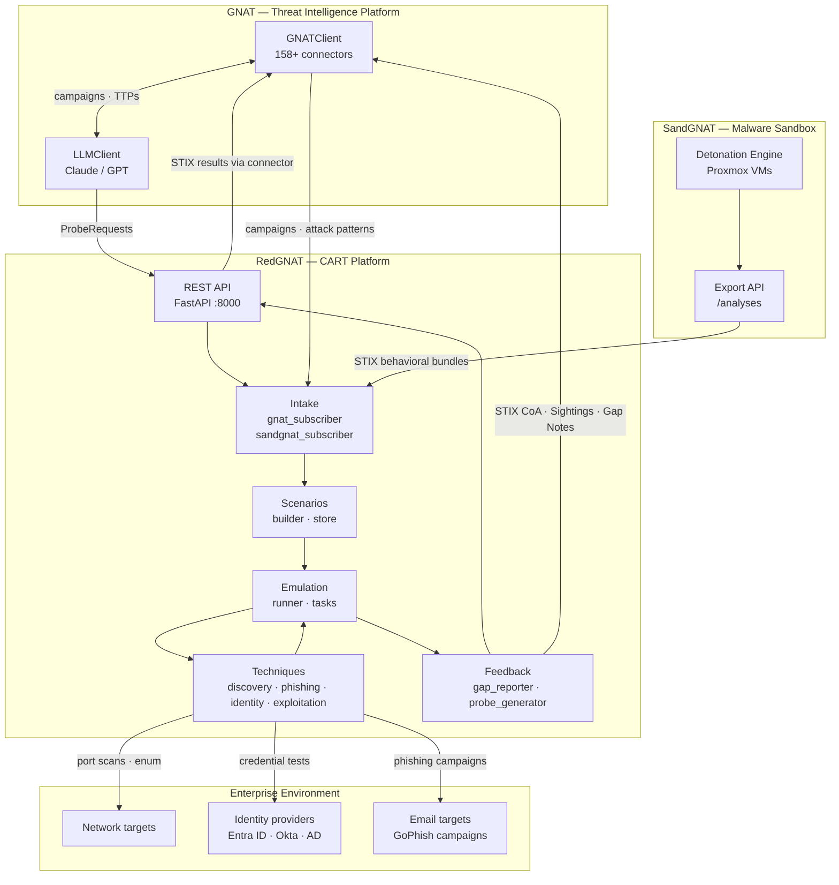
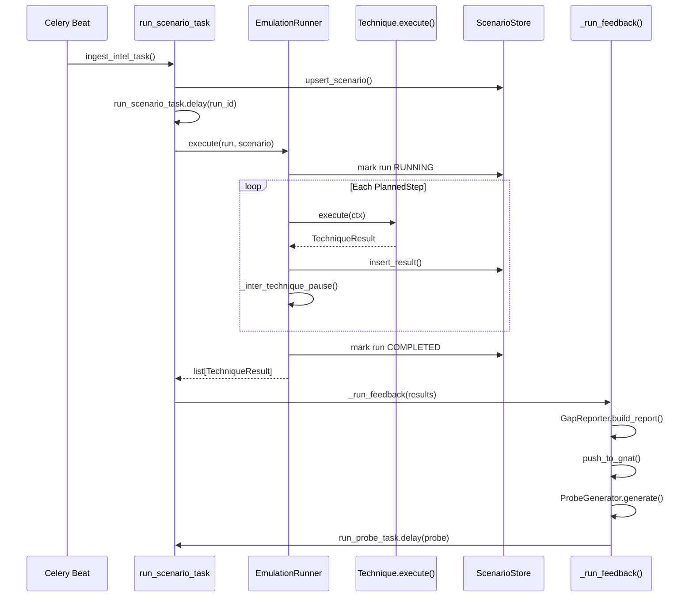
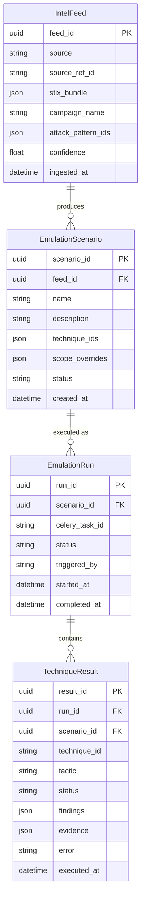

# Architecture

RedGNAT sits between three systems: GNAT (threat intelligence platform), SandGNAT (malware sandbox), and the defender's enterprise environment. Its job is to translate live threat intelligence into emulation runs, execute them safely, and return results back to GNAT as structured intelligence.

---

## System context

---

## Component overview

### Intake layer

`redgnat/intake/` has two subscribers that poll their respective sources on a Celery beat schedule:

- **`GNATSubscriber`** — polls `GNATClient.list_objects("campaign")`, fetches associated `attack-pattern` objects, extracts ATT&CK IDs from `external_references`, and filters by `min_confidence`
- **`SandGNATSubscriber`** — polls SandGNAT's `/analyses` endpoint, fetches full STIX bundles, and filters to emulatable technique families

Both subscribers produce `IntelFeed` records, which `IntelNormalizer` converts into `EmulationScenario` objects.

**`IntelNormalizer`** maps ATT&CK IDs to registered `Technique` classes, deduplicates, and sorts by kill-chain order (reconnaissance → initial-access → credential-access).

### Scenario layer

`redgnat/scenarios/` manages:

- **`ScenarioBuilder`** — builds an `EmulationPlan` from a scenario: resolves technique classes from the registry, applies scope from config, creates ordered `PlannedStep` objects
- **`ScenarioStore`** — all SQL in one module; upserts are idempotent so re-ingesting the same campaign is safe
- **`TTPMapper`** — static ATT&CK metadata (name, tactic, description) for 30+ techniques

### Emulation layer

`redgnat/emulation/` drives execution:

### Technique layer

`redgnat/techniques/` implements the ATT&CK technique library across four categories:

| Directory | Tactics | Runner required |
|-----------|---------|----------------|
| `discovery/` | TA0007, TA0043 | `EmulationRunner` |
| `phishing/` | TA0001 | `EmulationRunner` |
| `identity/` | TA0006 | `EmulationRunner` |
| `exploitation/` | various | `EngagementRunner` (Phase 2 only) |

Every technique follows the same contract enforced by the `Technique` abstract base class:

1. Check `scope.dry_run` first → return `DRY_RUN` immediately if true
2. Validate every target with `_check_scope_*()` before touching it
3. Call `_rate_sleep()` before each network request
4. Return a `TechniqueResult` with structured findings

Phase 2 exploitation techniques additionally require `emulation_only = False`, pass through the three-factor `EngagementGate`, and have their execution interleaved with kill-switch and token-expiry checks via `EngagementRunner`.

### Feedback layer

`redgnat/feedback/` closes the loop:

- **`GapReporter`** — identifies `SUCCESS` results (= undetected), builds `GapReport`, serialises to STIX 2.1 Note with per-technique GNAT enrichment hints, pushes to GNAT
- **`ProbeGenerator`** — calls `gnat.agents.LLMClient` with gap context; parses the LLM's JSON suggestions into `ProbeRequest` objects; falls back to a static rule table if the LLM is unavailable

### API layer

`redgnat/api/` exposes two audiences:

| Audience | Endpoints |
|----------|-----------|
| Operators (human) | `GET/POST /scenarios`, `GET/POST /runs`, `POST /intel/ingest`, `GET /intel/techniques` |
| Engagement control | `GET /engage/status`, `POST /engage/authorize`, `POST /engage/kill`, `DELETE /engage/kill` |
| GNAT connector (machine) | `GET /stix/results`, `GET /stix/sightings`, `GET /stix/gaps` |
| GNAT AI agents (machine) | `POST /intel/probe-request` |

---

## Data model

---

## Technology choices

| Decision | Choice | Reason |
|----------|--------|--------|
| Config format | INI (`configparser`) | Matches GNAT / SandGNAT convention; zero extra dependencies |
| Database | PostgreSQL + psycopg3 | JSONB for STIX bundles and findings; same choice as SandGNAT |
| All SQL in one module | `scenarios/store.py` | Prevents SQL scattered across the codebase |
| Task queue | Celery + Redis | Async, retryable, rate-limited; beat scheduler drives periodic polling |
| HTTP | `urllib.request` / `urllib3` | Matches GNAT's no-`requests` convention |
| Serialisation | STIX 2.1 dicts | Native GNAT ORM format; no additional translation layer |
| GNAT integration | `ConnectorMixin` plugin + PyPI entry point | GNAT discovers the connector automatically; no GNAT source modifications |
| AI calls | `gnat.agents.LLMClient` | Reuses GNAT's existing LLM infrastructure; supports Claude, GPT, and Grok backends |
