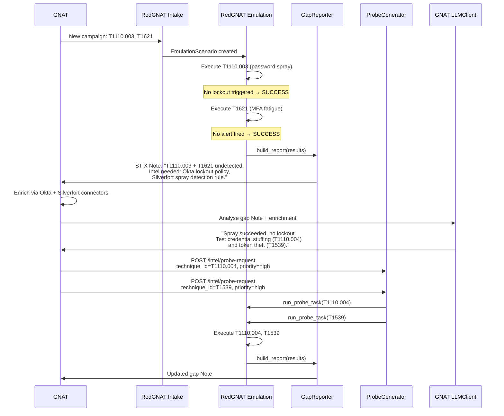
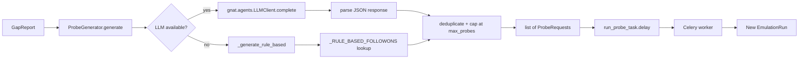
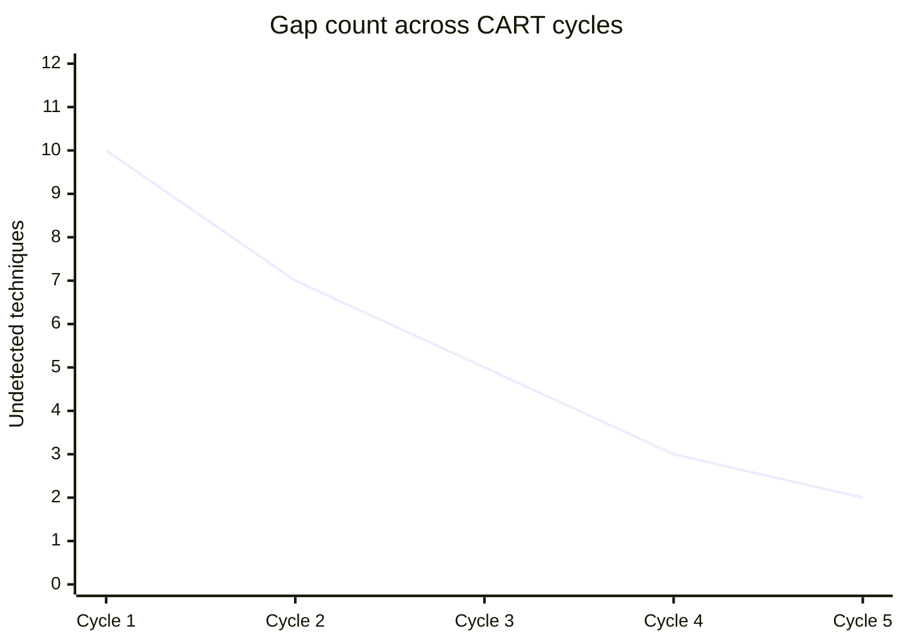

# The bidirectional feedback loop

RedGNAT's defining feature is a closed loop between emulation execution and threat intelligence. This article explains how the loop works, why it matters, and the design choices behind it.

---

## The problem it solves

A one-shot red team engagement answers the question: *"Can these specific techniques get through today?"* But the threat landscape changes continuously. A technique that was detected last quarter may slip through after a SIEM rule change, a staff rotation, or a platform update.

CART (Continuous Automated Red Teaming) keeps asking the same question on a schedule. But a simple loop — ingest intel → emulate → report → repeat — misses an opportunity: the *results themselves* are intelligence. When a technique goes undetected, that tells you something precise: what the adversary would know, what the defender doesn't see, and what follow-on techniques are now low-risk for a real attacker.

The feedback loop turns that implicit knowledge into explicit, actionable tasks.

---

## The loop, step by step



---

## What "undetected" means

A technique result with `status = SUCCESS` means the technique completed its full execution sequence without RedGNAT observing any detection alert. This does **not** mean the defender has no capability — it means the technique ran and no alert appeared in the interface or response that RedGNAT can observe.

In practice this is the most actionable finding: the attacker would have gotten the same result and the defender wouldn't know.

`DETECTED` means RedGNAT observed a response consistent with detection (lockout, challenge, alerting behaviour). `BLOCKED` means the scope check prevented execution — the target was out of scope. Neither of these is a gap.

---

## Gap reports as STIX intelligence requirements

`GapReporter` converts each gap into a STIX 2.1 `note` object. The note is structured so GNAT can:

1. **Ingest it directly** via `GNATClient.upsert_object(note)` — it appears in the GNAT workspace alongside campaigns and IOCs
2. **Pull it via the connector** — `connector.list_objects("note")` fetches all gap notes from `GET /stix/gaps`
3. **Task collection** — the `x_redgnat_gap` extension and note `content` specify which GNAT connectors should be queried (Shodan, Semperis, Silverfort, Okta, etc.)

Each technique has a corresponding entry in `_INTEL_ASKS` (in `gap_reporter.py`) — a curated description of what a GNAT operator or AI agent should collect to understand the gap.

Example for T1110.003 (password spray undetected):

```
Pull Okta smart lockout policy via Okta connector.
Check Entra ID sign-in risk policy in Sentinel.
Verify password spray detection rule in Silverfort.
```

---

## AI-driven probe generation

`ProbeGenerator` is where intelligence becomes new attacks. After a gap report is built, it calls `gnat.agents.LLMClient` (backed by Claude) with:

- The list of undetected techniques and their tactics
- A prompt asking for follow-on probes with rationale and priority

The LLM response is a JSON array of probe suggestions. `ProbeGenerator` parses this, deduplicates, and returns a list of `ProbeRequest` objects — each representing a single follow-on technique to run.

If the LLM is unavailable (no `gnat` package, network failure, API error), `ProbeGenerator` falls back to `_RULE_BASED_FOLLOWONS` — a static table of technique-to-followon mappings derived from ATT&CK kill-chain logic. This ensures the loop continues even without a live LLM.



---

## Probe requests as the intake path

`ProbeRequest` objects re-enter RedGNAT through the same Celery queue as normal emulation runs. `run_probe_task` builds a minimal `IntelFeed` and `EmulationScenario` from the probe's single technique and runs it synchronously. The result feeds back into the same gap/feedback pipeline.

This means a probe can itself generate further probes — the loop deepens until either:
- All probed techniques are `DETECTED` (coverage converges)
- `max_probes_per_report` is reached (runaway guard)
- The follow-on technique isn't in the registry (skipped with a warning)

---

## Convergence

Over many cycles the loop drives toward coverage convergence: the set of undetected techniques shrinks as GNAT enriches intelligence, operators tune detection, and RedGNAT validates the fixes.



The gap count never reaches zero in practice — new intel from GNAT introduces new scenarios — but the trend tracks defensive improvement over time. The CART report (available at `GET /runs/{run_id}/report`) surfaces this as an ATT&CK coverage matrix showing detected vs. undetected techniques per tactic.

---

## Design constraints

**AI calls are never in the hot path.** `ProbeGenerator` is called by `_run_feedback()` after a run completes, not during technique execution. This keeps emulation latency predictable and ensures a slow or unavailable LLM cannot block an active run.

**The loop is bounded.** `max_probes_per_report` (default 10) prevents a single gap-heavy run from flooding the queue with follow-on tasks.

**Rule-based fallback preserves continuity.** The LLM is an enhancement, not a dependency. The rule table covers the most common kill-chain progressions and ensures the loop runs even in air-gapped or offline deployments.

**Scope applies to probe-generated runs.** `run_probe_task` builds scenarios through the same normalizer and scope-checking path as intel-driven runs. A probe can only target techniques and targets that pass the configured scope.
