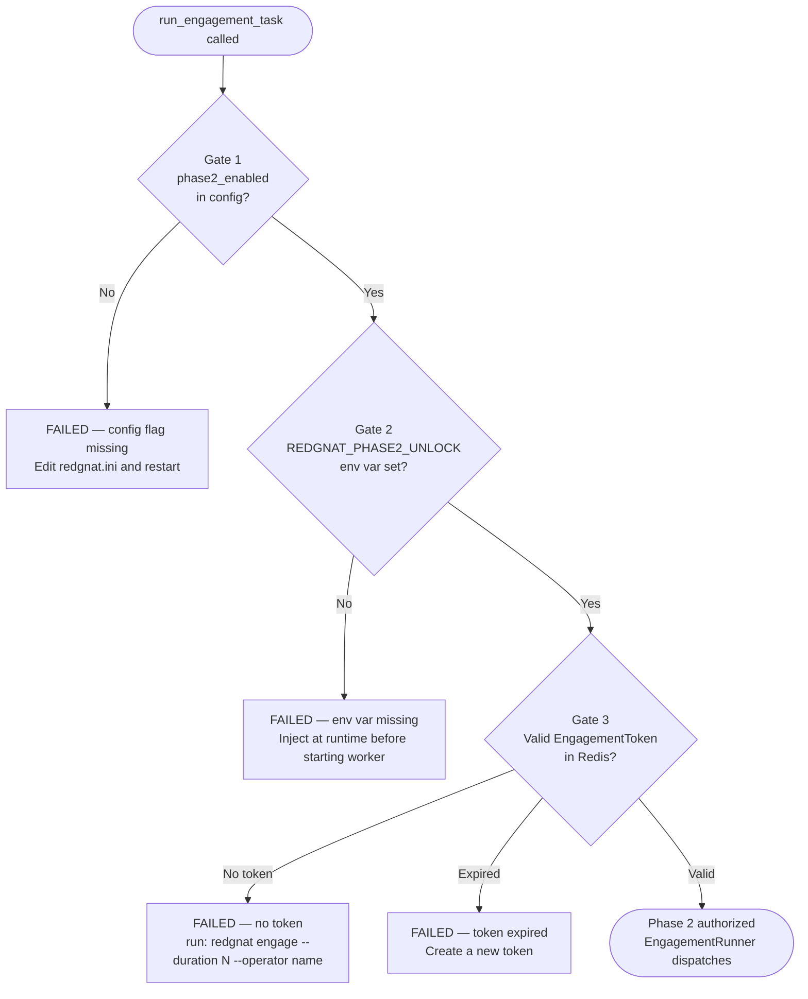
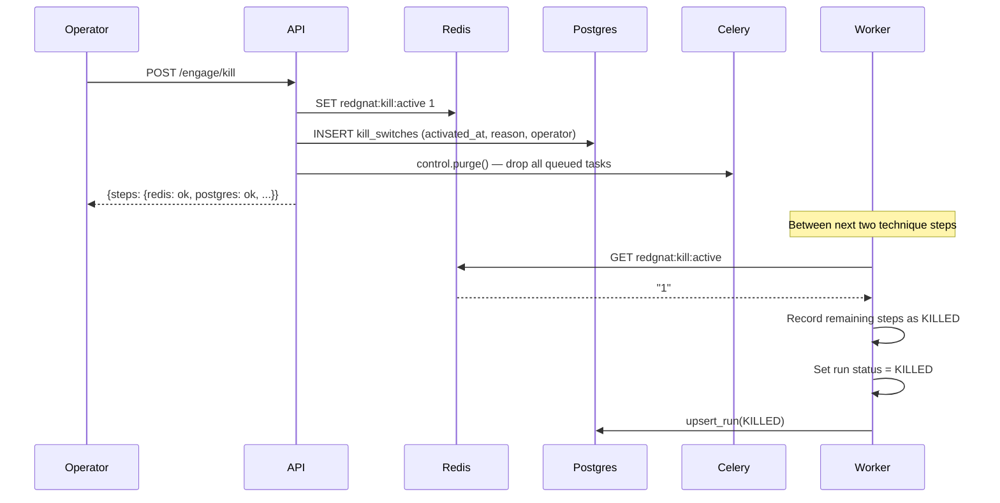

# Phase 2 Activation Model

> **Explanation** — this page describes *why* the Phase 2 safety system works the way it does.
> For step-by-step instructions see [How to authorize a Phase 2 engagement](../how-to/phase2-engagement.md).

---

## Why a Hard Impasse?

Phase 1 techniques observe, enumerate, and probe — they never exploit.  
Phase 2 techniques go further: controlled exploitation, persistence probing, and lateral-movement simulation.

The risk profile is categorically different.  A mis-click, a stale scenario, or a misconfigured scope could trigger
real exploitation against a production system.  The impasse exists so that "accidentally running Phase 2" is
*architecturally impossible*, not just unlikely.

---

## The Three-Factor Impasse

Phase 2 is blocked at three independent layers.  All three must be satisfied simultaneously for a single technique
to fire.  Failing any one factor immediately blocks the run — the remaining factors are not checked.



### Gate 1 — Config Flag

```ini
# redgnat.ini
[redgnat]
phase2_enabled = true
```

This is a durable, version-controlled change.  It signals that the *deployment* has been reviewed and configured
for Phase 2.  Setting it to `true` is a deliberate act that requires editing a file and restarting workers.

**Default:** `false`.  The flag ships as `false` and is never auto-enabled.

### Gate 2 — Runtime Environment Variable

```bash
export REDGNAT_PHASE2_UNLOCK=<activation-secret>
celery -A redgnat.emulation.tasks worker ...
```

This must be injected at worker startup — it cannot be baked into a config file or Docker image layer.
Its purpose is to separate *deployment-time* config (gate 1) from *runtime* intent (gate 2).

A worker started without this variable will refuse all Phase 2 tasks even if the config flag is set.

**Why an env var and not a second config key?**  Config files are often committed to version control, stored in
secrets managers, and shared across environments.  An env var is session-scoped: it lives only in the process
that was given it, and disappears when that process exits.

### Gate 3 — Time-Bounded Engagement Token

```bash
redgnat engage --operator "alice@example.com" --duration 4
# or: POST /api/v1/engage/authorize
```

The engagement token is the *per-operation* authorization.  An operator must explicitly create it immediately
before each engagement window.  The token expires automatically — Phase 2 stops at the next inter-technique
checkpoint after expiry, regardless of how many techniques remain in the plan.

**Properties:**
- Stored in Redis with a TTL matching the token lifetime (plus a 60-second grace window for in-flight steps)
- Re-checked between *every* technique step, not just at run start
- Maximum duration: 24 hours
- One token active at a time; creating a new one overwrites the previous

---

## Kill Switch

The kill switch is the big red button.  Activating it immediately:

1. Sets `redgnat:kill:active` in Redis — checked before every technique step by all workers
2. Writes a durable record to Postgres — survives Redis restart
3. Purges the Celery task queue — removes all pending tasks
4. Closes all active GoPhish campaigns
5. Pushes a CRITICAL STIX Note to GNAT



### Kill Switch Persistence

The two-layer model (Redis + Postgres) ensures the flag survives a Redis restart:

- **Redis** is the fast path — checked before every technique step, O(1), no SQL overhead
- **Postgres** is the durable record — workers check it on startup and refuse Phase 2 tasks if an uncleared kill record exists

A kill switch that can be bypassed by restarting Redis is not a kill switch.

### Resetting the Kill Switch

```bash
redgnat kill --reset --operator "alice@example.com"
# or: DELETE /api/v1/engage/kill
```

Reset **clears** the flag but does **not** restart workers, re-queue tasks, or reopen GoPhish campaigns.
The operator is explicitly responsible for reviewing what triggered the kill before resuming operations.

---

## Token Expiry Mid-Run

If the engagement token expires while a run is executing, `EngagementRunner` detects it at the next
inter-technique pause and records all remaining techniques as `ResultStatus.EXPIRED`:

```
Run R-001  [T1046 ✓]  [T1087 ✓]  [T1110.003 ✗ EXPIRED]  [T1621 ✗ EXPIRED]
```

The run status is set to `KILLED` (the same terminal status used for kill switch events).  No technique
that did not execute is silently omitted — every step is accounted for in the run record.

---

## Comparison: Phase 1 vs Phase 2 Runner

| Property | EmulationRunner (Phase 1) | EngagementRunner (Phase 2) |
|----------|--------------------------|---------------------------|
| Kill switch check | ✓ between every step | ✓ between every step |
| Engagement gate check | — | ✓ between every step |
| Auto-retry on failure | ✓ (3 retries, 60s delay) | ✗ never retried |
| Techniques allowed | `emulation_only = True` only | Any technique |
| Unexecuted step status | KILLED | KILLED or EXPIRED |

---

## Audit Trail

Every engagement-related event is persisted:

| Event | Where |
|-------|-------|
| Token created | Redis (TTL) + operator log line |
| Token revoked | Redis delete + operator log line |
| Kill activated | Redis + `kill_switches` Postgres table + GNAT STIX Note |
| Kill reset | `kill_switches.cleared_at` updated |
| Phase 2 gate denied | `run.status = FAILED` + log warning |
| Token expired mid-run | `TechniqueResult.status = EXPIRED` for each unexecuted step |
