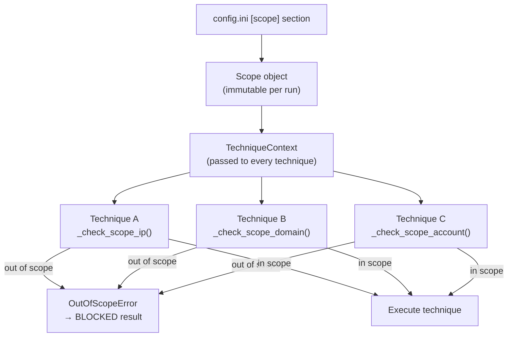

# Safe-harbor design

RedGNAT is built around a core principle: automated offensive tooling must be harder to misfire than to operate safely. This article explains the layered controls that enforce this, and the philosophy behind them.

---

## The scope object is the single source of truth

Every technique in RedGNAT receives a `Scope` object in its `TechniqueContext`. The `Scope` is constructed from the `[scope]` config section at startup and is **immutable during a run**. There is no mechanism for a technique to widen its own scope.



The scope gate is not optional. The `Technique` base class provides three guard methods — `_check_scope_ip()`, `_check_scope_domain()`, `_check_scope_account()` — that raise `OutOfScopeError` if a target is not in scope. Techniques that don't call these methods before acting are non-conforming.

The parametrized dry-run test in `tests/unit/techniques/test_dry_run.py` covers every registered technique automatically, but scope validation is a code review concern — automated tests check dry-run compliance, not scope-gate placement.

---

## The five safe-harbor controls

### 1. Scope checks

`Scope.allows_ip(ip)` returns `True` only if the IP is within a `target_ranges` CIDR **and** not within any `excluded_ranges` CIDR.

`Scope.allows_domain(domain)` checks the domain and all its parent zones against `target_domains` and `excluded_domains`.

`Scope.allows_account(upn)` does an exact match against `target_accounts`. There is no wildcard or domain match — only explicitly listed UPNs are permitted for credential techniques.

### 2. Dry-run mode

When `scope.dry_run = True`, every technique must return `_dry_run_result()` immediately, before any socket is opened or any API call is made. The result describes what the technique *would* have done in plain English.

This is the first check inside `execute()`, before scope validation. A technique in dry-run mode never touches the network, even if the target is in scope.

Dry-run is designed to be the default for new deployments. The getting-started tutorial starts with `dry_run = true`.

### 3. Rate limiting

`_rate_sleep(scope, n_requests=1)` sleeps the appropriate fraction of a minute before each network request based on `scope.max_rate_per_minute`. This applies uniformly across all techniques.

Identity techniques (password spray, MFA fatigue, credential stuffing) add random jitter on top of the base rate limit to avoid producing detectable patterns from the regularity of the requests themselves.

### 4. Test-account-only for credential techniques

Credential techniques (T1110.003, T1110.004, T1621) operate exclusively on accounts listed in `scope.target_accounts`. This is enforced before any authentication attempt:

```python
self._check_scope_account(ctx.scope, upn)
```

There is no "spray everything in the domain" mode. The test account list must be explicitly populated. An empty `target_accounts` means credential techniques produce zero attempts.

### 5. The phase flag

`Technique.emulation_only = True` is the Phase 1 default. Phase 1 techniques observe, enumerate, and probe — they do not deliver payloads, modify state, or exploit vulnerabilities.

This flag is a **design checkpoint**, not a runtime access control. It communicates intent to developers and reviewers. Phase 2 exploitation techniques will set `emulation_only = False` only after explicit design review and with additional safety controls (scope guard for `allow_exploitation`, mandatory operator confirmation, audit trail requirements — see `redgnat/techniques/exploitation/README.md`).

---

## What happens when a scope check fails

An out-of-scope target produces a `BLOCKED` result, not an error. The emulation run continues with the next technique. Nothing is logged to the target — there is no network activity.

```
[INFO] Technique T1046: target 203.0.113.5 is out of scope — blocked
[DEBUG] TechniqueResult(technique_id='T1046', status=ResultStatus.BLOCKED, ...)
```

`BLOCKED` results appear in the run's results list and in the CART report so operators can see that a technique was skipped due to scope rather than succeed silently.

---

## Why excluded_ranges takes precedence

The `excluded_ranges` list always wins over `target_ranges`, even if a CIDR in `target_ranges` overlaps with one in `excluded_ranges`. This means you can safely add broad ranges to `target_ranges` (e.g. `10.0.0.0/8`) and then carve out specific subnets:

```ini
[scope]
target_ranges = 10.0.0.0/8
excluded_ranges = 10.0.0.1/32,10.1.0.0/24
```

Any technique that targets `10.0.0.1` or anything in `10.1.0.0/24` will be blocked. Ordering in the config file does not matter.

---

## Scope and probe-generated runs

When `ProbeGenerator` creates follow-on `ProbeRequest` objects and `run_probe_task` builds new emulation runs, those runs go through the same scope validation path as intel-driven runs. The probe mechanism cannot be used to expand scope — a probe targeting out-of-scope IPs will produce `BLOCKED` results just like any other technique.

---

## What safe-harbor does not protect against

Safe-harbor controls protect against **accidental** out-of-scope activity. They do not protect against:

- **Misconfigured scope** — if `target_ranges` includes production systems that should be excluded, techniques will target them. Scope configuration is a human responsibility.
- **Compromised config** — if an attacker can modify `config.ini`, they can modify scope. Protect the config file accordingly.
- **Bugs in technique implementations** — a technique that skips scope checks will not be caught at runtime. Code review and the dry-run test suite are the mitigations.
- **Phase 2 exploitation** — once implemented, Phase 2 techniques can cause real impact. The additional controls described in the exploitation README are designed to compensate, but they require operator discipline.
