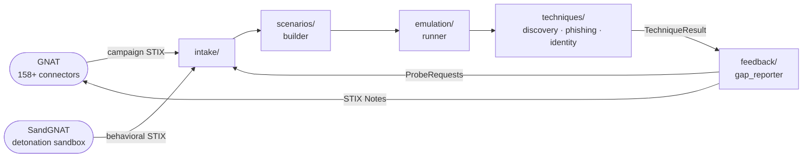

# RedGNAT

  
  

    <h1>RedGNAT</h1>
    
Continuous Automated Red Teaming &mdash; CART Addon for GNAT

  

  
  
  
  

RedGNAT ingests live threat intelligence from **GNAT** and **SandGNAT**, automatically builds
adversary emulation scenarios mapped to MITRE ATT&CK, executes them against your environment,
and feeds results back as actionable intelligence requirements — closing the CART loop continuously.

---

## Documentation map

This documentation follows the [Diataxis](https://diataxis.fr) framework.
Pick the quadrant that matches what you need right now.

  <a class="diataxis-card" href="tutorials/getting-started/">
    <h3>📖 Tutorials</h3>
    
Learning-oriented. Start here if you are new to RedGNAT — install, configure, and run your first scenario end-to-end.

  </a>
  <a class="diataxis-card" href="how-to/add-technique/">
    <h3>🛠 How-to Guides</h3>
    
Task-oriented. Step-by-step guides for adding techniques, wiring GNAT integration, and deploying to production.

  </a>
  <a class="diataxis-card" href="reference/configuration/">
    <h3>📐 Reference</h3>
    
Information-oriented. Every configuration key, REST endpoint, and technique parameter — precise and complete.

  </a>
  <a class="diataxis-card" href="explanation/architecture/">
    <h3>💡 Explanation</h3>
    
Understanding-oriented. Architecture decisions, the feedback loop, safe-harbor design, and Phase 2 activation model.

  </a>

---

## Quick links

| I want to… | Go to |
|------------|-------|
| Install and run my first scenario | [Getting started](tutorials/getting-started.md) |
| Add a new ATT&CK technique | [Add a technique](how-to/add-technique.md) |
| Wire up GNAT ↔ RedGNAT | [Configure GNAT integration](how-to/configure-gnat-integration.md) |
| See all config keys | [Configuration reference](reference/configuration.md) |
| Understand the kill switch | [Phase 2 activation](explanation/phase2-activation.md) |
| Browse the REST API | [API reference](reference/api.md) |

---

## What RedGNAT does

**Phase 1 (current):** emulation and probing — observe, enumerate, phish, spray. Never exploit.

**Phase 2 (planned):** controlled exploitation with three-factor authorization and a global kill switch.
