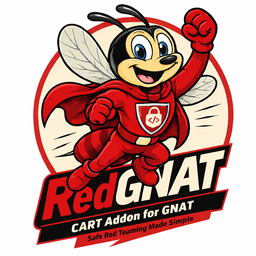

# RedGNAT

Continuous Automated Red Teaming (CART) addon for the **GNAT-o-sphere**: ingest live threat intelligence from GNAT and SandGNAT, build scoped adversary-emulation scenarios, execute them under layered safety controls, and feed detection gaps back into GNAT as structured intelligence requirements.

Source: [`github.com/wrhalpin/RedGNAT`](https://github.com/wrhalpin/RedGNAT).

---

## Documentation

Organised with the [Diátaxis](https://diataxis.fr/) framework. Four quadrants for four kinds of reader intent:

|  | **Action (doing)** | **Study (reading)** |
|---|---|---|
| **Learning** | [Tutorials](tutorials/README.md) | [Explanation](explanation/architecture/architecture.md) |
| **Working** | [How-to guides](how-to/README.md) | [Reference](reference/README.md) |

### Start here if you're…

- **New to RedGNAT** → [Getting started](tutorials/getting-started.md)
- **Adding a technique** → [How to add a technique](how-to/add-technique.md)
- **Connecting to GNAT** → [Configure GNAT integration](how-to/configure-gnat-integration.md)
- **Curious about the safety model** → [Safe-harbor design](explanation/engagement/safe-harbor.md)
- **Standing up production** → [Deploy with Docker](how-to/deploy-docker.md)

---

## What RedGNAT does, end to end

1. **Intake** — `GNATSubscriber` polls GNAT for new campaigns and TTPs; `SandGNATSubscriber` polls SandGNAT for fresh STIX behavioral bundles.
2. **Normalise** — `IntelNormalizer` maps STIX AttackPattern objects to registered `Technique` classes and builds an ordered `EmulationScenario`.
3. **Execute** — `EmulationRunner` dispatches each technique via Celery, enforcing scope, dry-run, and rate-limit controls at every step.
4. **Report gaps** — `GapReporter` converts undetected techniques into STIX 2.1 Note objects and pushes them back to GNAT as intelligence requirements.
5. **Generate probes** — `ProbeGenerator` calls GNAT's `LLMClient` (Claude) with gap context; suggests follow-on techniques as `ProbeRequest` objects.
6. **Repeat** — probe tasks re-enter the same pipeline, deepening coverage until detected or the runaway guard trips.

Full architecture diagrams and component breakdown in [explanation/architecture](explanation/architecture/architecture.md).

## Key design choices

- **Scope guard is non-negotiable.** Every technique calls `_check_scope()` before any network activity. Out-of-scope targets produce `BLOCKED` results, not errors. See [safe-harbor design](explanation/engagement/safe-harbor.md).
- **Phase 2 requires three independent factors.** Exploitation techniques need a config flag, a runtime env var, and a time-bounded Redis token — all simultaneously. See [Phase 2 activation](explanation/engagement/phase2-activation.md).
- **The feedback loop is the point.** A single-shot emulation run has limited value. The gap→probe→emulate cycle is what drives coverage convergence over time. See [feedback loop](explanation/automation/feedback-loop.md).
- **AI calls stay out of the hot path.** `ProbeGenerator` runs post-completion. A slow or unavailable LLM cannot block an active run.

## In the GNAT-o-sphere

| Project | Role |
|---------|------|
| [GNAT](https://github.com/wrhalpin/GNAT) | Core threat intelligence platform — 159 connectors, STIX ORM, AI agents |
| [SandGNAT](https://github.com/wrhalpin/SandGNAT) | Malware detonation sandbox — STIX 2.1 behavioral profiles |
| **RedGNAT** | CART engine — turns intel into scoped adversary emulation |

## Status

v0.1.0 — Phase 1 (emulation and probing) and Phase 2 engagement infrastructure shipped. See [releases/v0.1.0](releases/v0.1.0.md).

Licensed under [Apache 2.0](https://github.com/wrhalpin/RedGNAT/blob/main/LICENSE).
